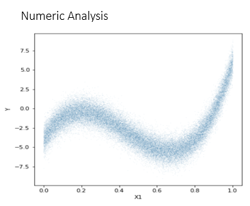
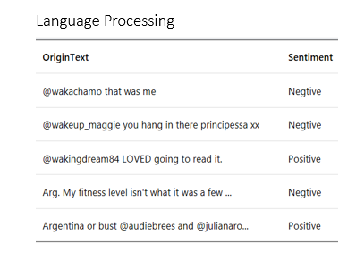

===================
ML.NET for Python
===================

.. toctree::
   :maxdepth: 2
   :caption: Contents:

Getting Started
===============

NimbusML is a Python module that provides experimental Python bindings for [ML.NET](https://www.microsoft.com/net/learn/apps/machine-learning-and-ai/ml-dotnet). 
It provides battle-tested state-of-the-art ML algorithms, transforms and components,
aiming to make them useful for all developers, data scientists, and information
workers and helpful in all products, services and devices. The components are
authored by the team members, as well as numerous contributors from MSR, CISL,
Bing and other teams at Microsoft.

``nimbusml`` is interoperable with ``scikit-learn`` estimators and transforms, while adding 
a suite of highly optimized algorithms written in C++ and C# for speed and performance. 
NimbusML trainers and transforms support the following data structures for the ``fit()`` and ``transform()`` methods:

* ``numpy.ndarray`` 
* ``scipy.sparse_cst``
* ``pandas.DataFrame``.
   
In addition, NimbusML also supports streaming from files without loading the dataset
into memory, which allows training on data significantly 
exceeding memory using [``FileDataStream``](docs-ref-autogen/nimbusml.FileDataStream.yml).

With [``FileDataStream``](docs-ref-autogen/nimbusml.FileDataStream.yml), NimbusML is able to handle
up to **billion** features and **billions** of training examples for select algorithms.

NimbusML can be easily used for the following problems:

.. image:: _static/images/examples2.png
      :target: tutorials/2-3.md

.. image:: _static/images/examples4.png
      :target: tutorials/2-5.md
For more details, please refer to the [tutorial section](tutorials.md).

Used by 
=============

.. image:: _static/images/customer.png

Documentation
=============

.. toctree::
    :maxdepth: 5
    
    installationguide
    concepts
    apiguide	
    modules	
    tutorial

.. index:: main page, home
